# Telemetry Platform Architecture Specification

**Document:** `docs/01_System_Architecture.md`
**Status:** Draft for architecture review
**Baseline:** Phase 9 modular collector architecture
**Purpose:** Define the current system architecture, governing engineering principles, and planned evolution of the Telemetry Platform.

---

## 1. Executive Summary

### 1.1 Purpose

Telemetry Platform is a modular, self-hosted telemetry collection and analysis platform designed to collect, normalize, store, and expose operational and security telemetry from Windows systems through a clean, layered architecture.

The platform is being engineered as the foundation for an intelligent operational-security system. Its long-term objective is to transform low-level infrastructure telemetry into actionable operational intelligence through deterministic analysis, event correlation, retrieval-augmented knowledge, and AI-assisted reasoning.

The current implementation focuses on establishing a stable backend architecture before introducing advanced analytics or user-facing capabilities. Early development prioritizes modularity, maintainability, extensibility, correctness, and testability over rapid feature growth.

### 1.2 Primary Goals

#### Reliable telemetry collection

The platform must collect Windows Event Log data and host-health telemetry without silently skipping events.

Core characteristics include:

- checkpoint-based collection
- transactional persistence
- deterministic event ordering
- resumable operation
- fault isolation
- explicit error reporting

#### Data normalization

Platform-specific telemetry is converted into a consistent internal representation before persistence.

Windows XML is transformed into structured Python dictionaries with normalized provider names, Event IDs, record IDs, severity levels, timestamps, event data, user data, and host identity.

#### Layered architecture

Each component owns one primary responsibility and communicates through a defined interface. This enables independent testing, focused refactoring, future plugin support, reduced coupling, predictable system behavior, and easier contributor onboarding.

#### Foundation for intelligent security

Future versions are expected to add event correlation, detection rules, risk scoring, knowledge retrieval, AI-assisted investigation, guided remediation, and controlled response playbooks. These capabilities will be layered above the deterministic telemetry pipeline rather than replacing it.

### 1.3 Current Scope

At the Phase 9 baseline, the platform includes:

- Windows Event Log collection
- host-health metric collection
- Windows XML parsing and normalization
- persistent checkpoint management
- PostgreSQL storage
- FastAPI query access
- explicit source registration
- polymorphic source handlers
- dependency injection through a collector factory
- unit testing for major components
- technical repository documentation

The platform intentionally does not yet include a production dashboard, detection engine, AI reasoning layer, or automated response engine.

### 1.4 Long-Term Vision

The Telemetry Platform is intended to evolve into a self-hosted operational intelligence platform for organizations that may not have dedicated security personnel.

Instead of requiring users to interpret raw Event IDs, XML payloads, and system logs, future versions should explain what happened, explain why it matters, identify affected systems, assign risk, recommend safe next steps, provide approved response actions, and maintain a complete audit trail.

AI is treated as an optional reasoning and explanation layer. Deterministic systems remain responsible for collection, parsing, persistence, correlation, authorization, and response guardrails.

### 1.5 Guiding Principles

- Reliability before convenience
- Modularity before feature accumulation
- Explicit configuration instead of hardcoding
- Deterministic processing before AI reasoning
- Composition before deep inheritance
- Transaction safety before throughput optimization
- Security boundaries before external exposure
- Documentation as part of the system
- Extension through registration and interfaces
- Human approval for high-impact response actions

---

## 2. Design Philosophy

### 2.1 Single Responsibility

Each module should own one primary responsibility.

| Module | Primary responsibility |
|---|---|
| `app/ingest.py` | Process entry point |
| `app/collector_factory.py` | Dependency construction |
| `app/collector.py` | Polling and run orchestration |
| `app/sources.py` | Source definitions |
| `app/source_handlers.py` | Source-specific execution |
| `app/windows_reader.py` | Windows Event Log access |
| `app/parsers/windows_event_parser.py` | XML parsing and normalization |
| `app/health_metrics.py` | Host metric collection |
| `app/repository.py` | Telemetry persistence |
| `app/state.py` | Checkpoint management |
| `app/database.py` | PostgreSQL connection creation |
| `app/config.py` | Environment-based configuration |
| `app/api.py` | REST query interface |

### 2.2 Separation of Concerns

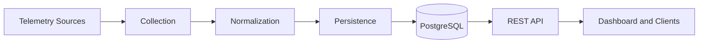

Architectural constraints include:

- parsers do not execute SQL
- repositories do not read Event Logs
- APIs do not advance collector checkpoints
- collectors do not build SQL
- state management does not depend on the API
- readers do not interpret business meaning

### 2.3 Composition over Inheritance

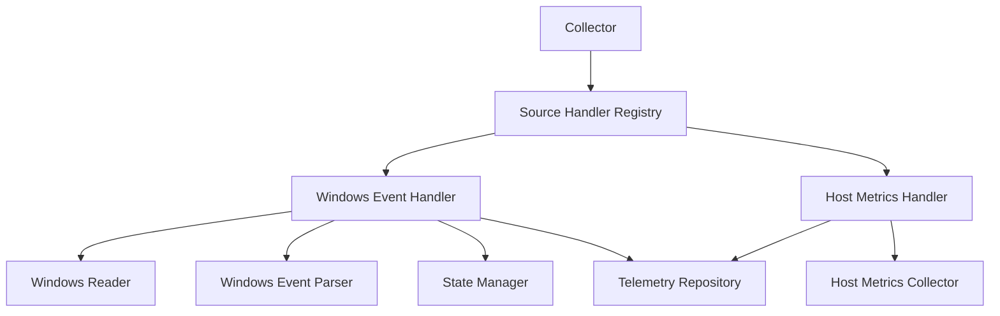

Inheritance is used only when a common behavioral contract provides clear value, such as the `SourceHandler` interface and future parser or reasoning-provider interfaces.

### 2.4 Dependency Injection

Concrete dependencies are created in `collector_factory.py` and supplied to the `Collector`.

Benefits include isolated testing, implementation replacement, centralized construction, simpler lifecycle management, and reduced hidden coupling.

### 2.5 Explicit Configuration

Runtime configuration is externalized through environment variables, including PostgreSQL settings, checkpoint path, polling interval, batch size, enabled sources, and logging level.

### 2.6 Deterministic Processing

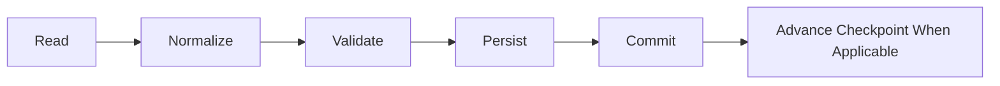

AI will operate only after deterministic analysis has produced qualified evidence.

### 2.7 Transaction Ownership

- source handlers own source-level transaction boundaries
- the collector owns collector-run transaction boundaries
- the repository never commits or rolls back
- checkpoint advancement occurs only after a successful commit

### 2.8 Defensive Failure Handling

The system degrades gracefully where possible. One channel failure does not terminate unrelated channels, unavailable `psutil` does not stop event collection, invalid source names produce explicit configuration errors, and failed database transactions do not advance checkpoints.

### 2.9 Testability

Major modules are independently testable through mocks and injected dependencies. Most unit tests do not require PostgreSQL, Sysmon, Windows Event Logs, or FastAPI.

### 2.10 AI as an Augmentation Layer

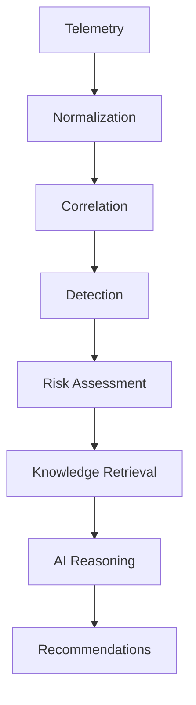

The model explains and recommends. Deterministic services own correctness, permissions, and execution.

---

## 3. Current System Architecture

### 3.1 System Overview

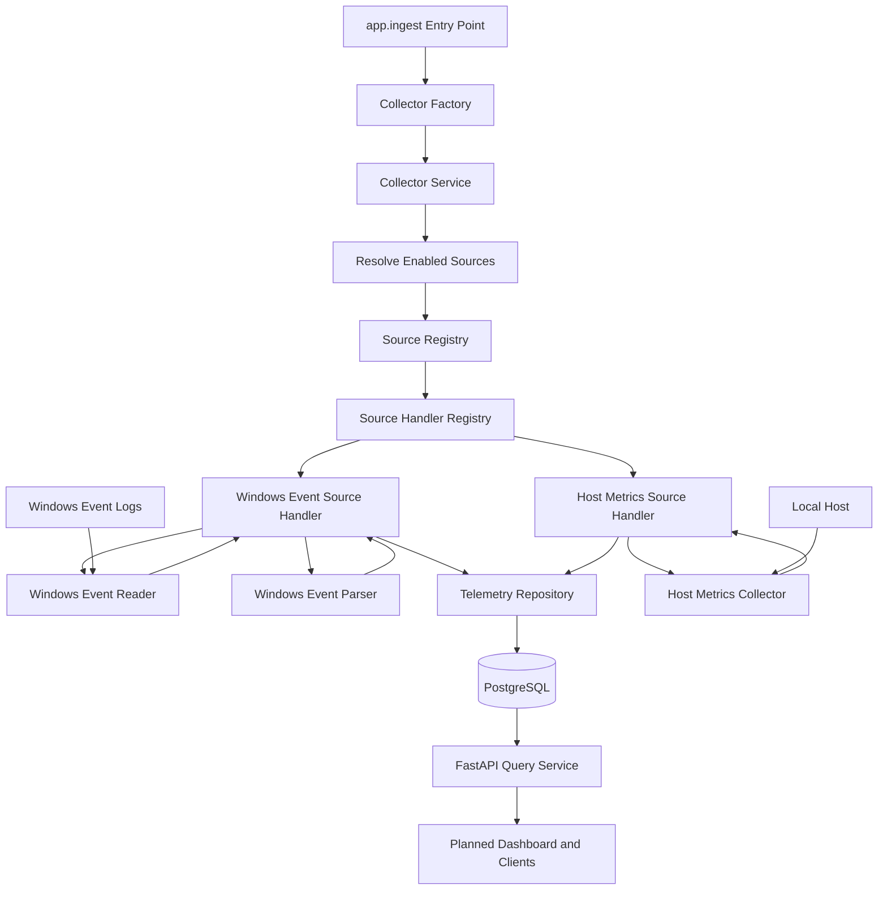

### 3.2 Supported Sources

Current source definitions include Windows System, Application, Security, Sysmon, PowerShell, Windows Defender, Task Scheduler, and local host metrics. The single `powershell` source reads two channels: `Windows PowerShell` and `Microsoft-Windows-PowerShell/Operational`.

Planned sources include Linux, Syslog, Proxmox, Wazuh, Zeek, Suricata, Docker, network devices, and cloud platforms.

### 3.3 Startup Sequence

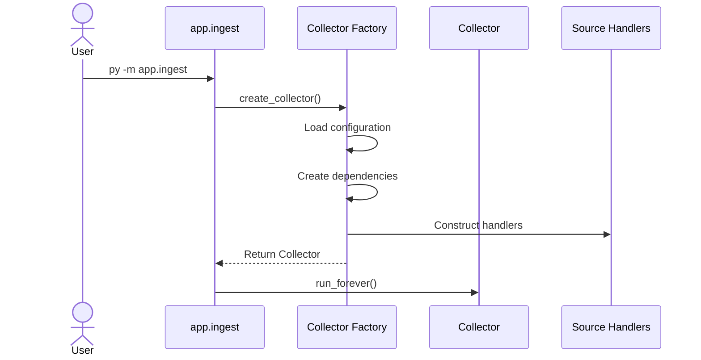

### 3.4 Polling Cycle

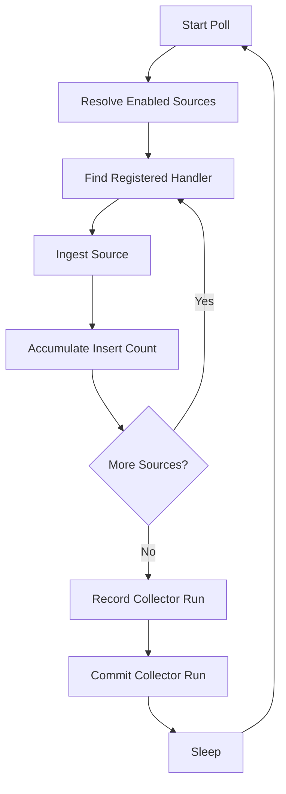

---

## 4. Component Responsibilities

### 4.1 `app/ingest.py`

Thin executable entry point responsible for logging, collector creation, continuous polling, keyboard interruption, and shutdown.

### 4.2 `app/collector_factory.py`

Composition root responsible for settings, hostname, state, reader, parser, metrics, connection, repository, handlers, and collector construction.

### 4.3 `app/collector.py`

Coordinates enabled sources, handler dispatch, run status, polling intervals, collector-run transactions, and connection shutdown.

### 4.4 `app/sources.py`

Defines supported source names, source kinds, Windows channels, validation, and source ordering.

### 4.5 `app/source_handlers.py`

Implements Windows and host-metric workflows, channel isolation, source-level transactions, persistence coordination, and checkpoint updates.

### 4.6 `app/windows_reader.py`

Encapsulates `EvtQuery`, `EvtNext`, `EvtRender`, query construction, batch limits, and native handle cleanup.

### 4.7 `app/parsers/windows_event_parser.py`

Converts Windows XML into normalized event dictionaries.

### 4.8 `app/health_metrics.py`

Collects CPU, memory, disk, boot-time, hostname, and optional-`psutil` status.

### 4.9 `app/repository.py`

Executes collector INSERT operations without committing, rolling back, parsing, or orchestrating.

### 4.10 `app/state.py`

Loads, validates, advances, and atomically saves source/channel checkpoints.

### 4.11 `app/api.py`

Exposes logs, search, statistics, and metrics over HTTP.

---

## 5. Data Flow and Sequence Architecture

### 5.1 Windows Event Flow

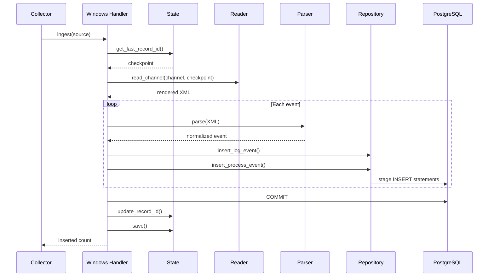

### 5.2 Host Metrics Flow

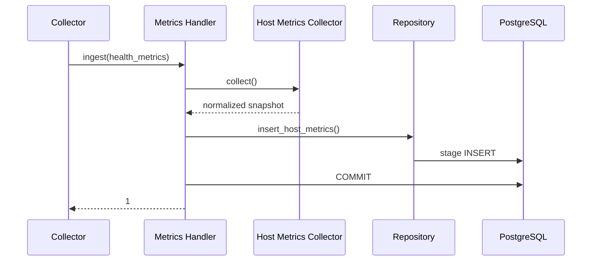

### 5.3 Windows Event Failure Recovery

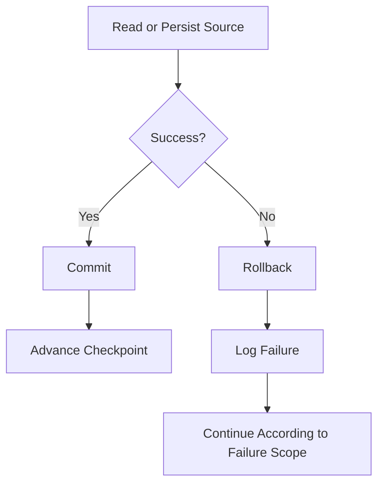

Checkpoint advancement applies to Windows Event Log sources. Host metrics
sources commit their database transaction but do not update collector
checkpoint state.

### 5.4 API Query Flow

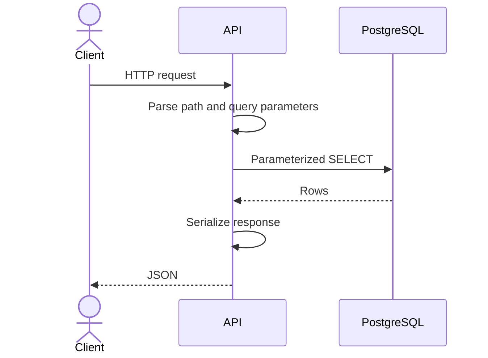

---

## 6. Database and Persistence Architecture

PostgreSQL is the persistent memory of the platform. It was selected for ACID transactions, mature indexing, Python support, JSON/JSONB capabilities, future `pgvector` compatibility, and scaling options.

### 6.1 Current Tables

| Table | Purpose |
|---|---|
| `log_events` | General normalized telemetry |
| `process_events` | Structured Sysmon process creation telemetry |
| `host_metrics` | Periodic host-health snapshots |
| `collector_runs` | Collector operational history |

### 6.2 Logical ER Model

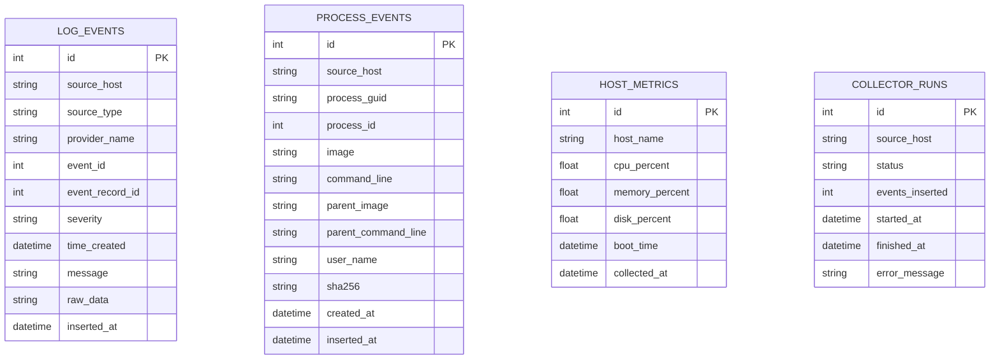

The current schema does not yet define formal foreign keys between these tables. Correlation relies on host identity, timestamps, source type, providers, Event IDs, and record identifiers.

### 6.3 Planned Database Work

- schema migrations
- deduplication constraints
- `TIMESTAMPTZ`
- `JSONB` raw payloads
- retention and archival
- partitioning
- backup verification
- asset inventory
- alerts and incidents
- audit records
- tenant isolation

---

## 7. API Architecture

The API is the boundary between persisted telemetry and consumers.

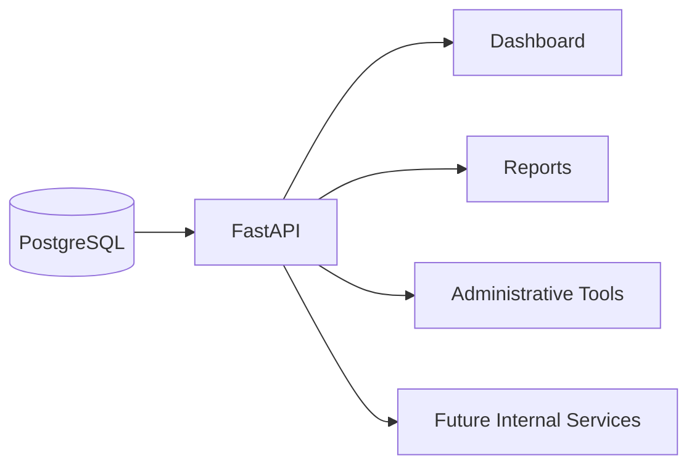

The current API exposes a root `/` status response plus endpoints for recent logs, provider filtering, Event ID filtering, source filtering, text search, event statistics, metric history, and latest metrics. A dedicated production health/readiness endpoint is planned but is not currently implemented.

Before commercial release, the API requires authentication, RBAC, API versioning, rate limiting, production connection pooling, formal response models, pagination, audit logging, and tenant isolation.

---

## 8. Security Architecture and Trust Boundaries

### 8.1 Principles

- least privilege
- explicit trust
- defense in depth
- fail secure
- auditability
- data minimization

### 8.2 Trust Boundary Overview

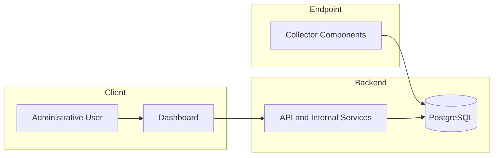

### 8.3 Current Controls

- environment-based credentials
- parameterized SQL
- explicit source validation
- Event Log permission handling
- monotonic, atomic state updates
- commit-before-checkpoint sequencing
- repository reviewed for committed secrets

### 8.4 AI Trust Boundary

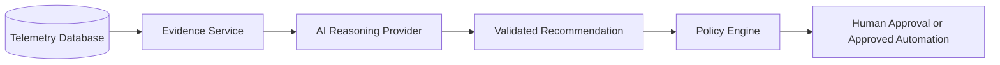

The reasoning model must not receive unrestricted database or operating-system access.

---

## 9. Deployment Architecture

### 9.1 Development

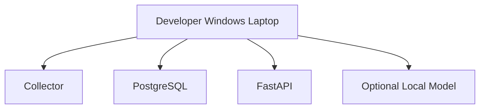

### 9.2 Homelab

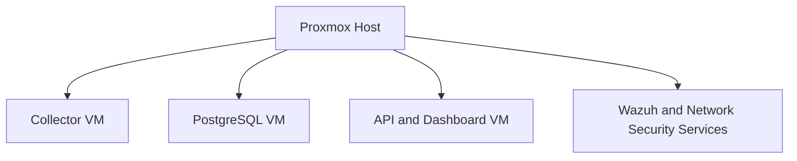

### 9.3 Small Business

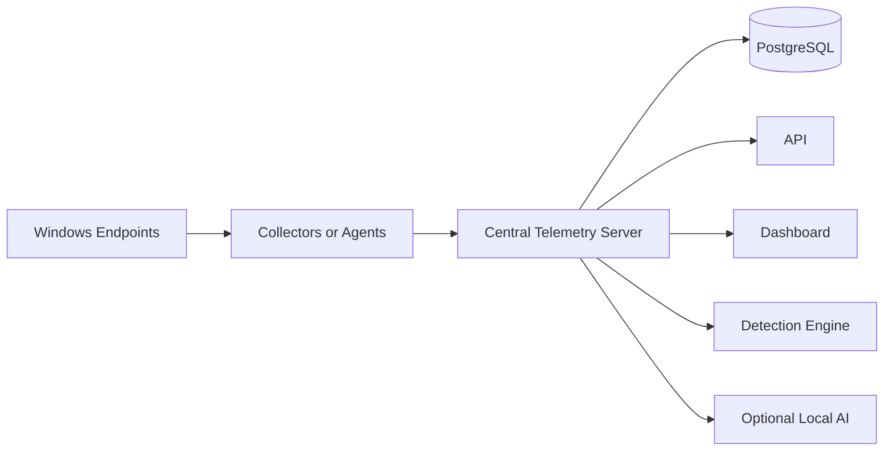

### 9.4 MSP

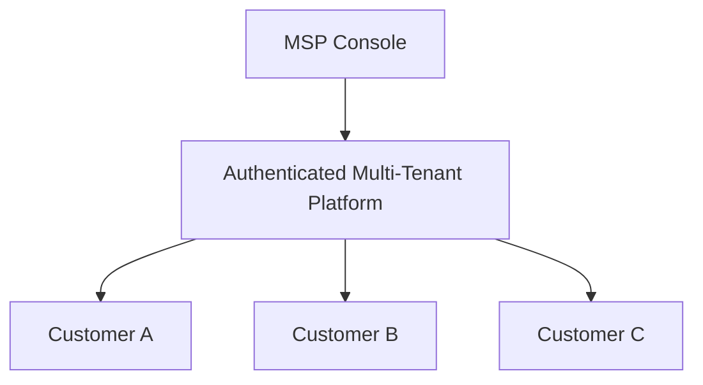

Commercial deployment concerns include signed installers, Windows service packaging, migrations, rollback, configuration preservation, licensing, update channels, support diagnostics, backups, and hardware sizing.

---

## 10. Testing and Quality Architecture

### 10.1 Principles

- test small components
- test observable behavior
- test failure paths
- add regression tests for resolved defects
- automate repeatable checks

### 10.2 Test Layers

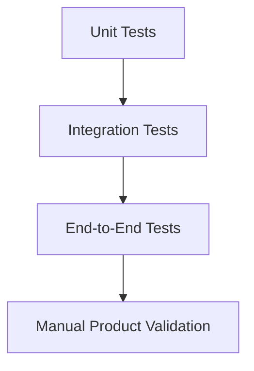

### 10.3 Planned CI Checks

- Python compilation
- unit tests
- integration tests
- Ruff
- Black
- MyPy
- Bandit
- `pip-audit`
- secret scanning
- Markdown validation
- broken-link checks
- Mermaid validation where supported

---

## 11. Planned Detection and Correlation Architecture

> **Implementation status:** Future-state design. This layer is not implemented in the Phase 9 baseline.


```mermaid
flowchart TD
 A[Normalized Telemetry] --> B[Enrichment]
 B --> C[Correlation]
 C --> D[Detection Rules]
 D --> E[Risk Scoring]
 E --> F[Alerts]
 F --> G[Incidents]
```

Planned components include a detection rule registry, evaluator, temporal correlation engine, asset context service, user context service, risk scorer, alert repository, incident service, and suppression framework.

Detection principles:

- deterministic rules before AI
- transparent evidence
- explainable scoring
- reproducible outcomes
- versioned rules
- testable scenarios
- explicit false-positive handling

---

## 12. Planned AI and Reasoning Architecture

> **Implementation status:** Future-state design. AI reasoning, RAG, and recommendation services are not implemented in the Phase 9 baseline.


```mermaid
flowchart TD
 A[Alert or Incident] --> B[Evidence Selection]
 B --> C[Knowledge Retrieval]
 C --> D[Reasoning Provider]
 D --> E[Structured Explanation]
 E --> F[Recommendation Validation]
 F --> G[Operator]
```

Provider options may include rules-only, a local 3B-4B model, a local 7B-8B model, a dedicated local inference server, an approved frontier API, or hybrid escalation.

The model should never process raw telemetry volume directly.

```mermaid
flowchart LR
 A[Large Telemetry Volume] --> B[SQL Filtering]
 B --> C[Correlation]
 C --> D[Detection]
 D --> E[Small Evidence Package]
 E --> F[Reasoning Model]
```

---

## 13. Commercial Product Architecture

> **Implementation status:** Product direction and release planning. The installer, dashboard, licensing, alerting, and commercial editions described below are planned rather than current capabilities.

### 13.1 Positioning

A self-hosted security and operational intelligence assistant for small organizations without dedicated security staff.

### 13.2 Initial Customer Profile

- 10-100 endpoints
- Windows-heavy environment
- sensitive business data
- no internal SOC
- owner, office manager, generalist IT staff, or MSP operator
- need for plain-language security guidance

### 13.3 Product Editions

| Edition | Intended audience |
|---|---|
| Community | Homelab, learning, evaluation |
| Professional | Small business |
| MSP | Multi-customer managed service |
| Enterprise | Large and regulated organizations |

### 13.4 Required Capabilities Before Sale

- installer
- Windows service
- reliable upgrades
- dashboard
- alerts
- detection content
- plain-language explanations
- backups
- authentication
- audit logging
- support bundle generation
- licensing
- secure defaults
- rollback procedures

---

## 14. Architecture Evolution

| Phase | Architectural outcome |
|---|---|
| Phase 1 | Configuration and database access extracted |
| Phase 2 | State manager extracted |
| Phase 3 | Windows Event reader extracted |
| Phase 4 | Windows Event parser extracted |
| Phase 5 | Host metrics collector extracted |
| Phase 6 | Persistence repository extracted |
| Phase 7 | Explicit source registry introduced |
| Phase 8 | Polymorphic source handlers introduced |
| Phase 9 | Collector service, factory, and thin entry point introduced |
| Phase 10+ | Detection, correlation, product hardening, and intelligence layers |

---

## 15. Architectural Decision Record Index

Recommended ADRs:

1. Why PostgreSQL
2. Why FastAPI
3. Why EventRecordID checkpointing
4. Why the repository does not own transactions
5. Why source handlers own source-specific execution
6. Why the collector uses dependency injection
7. Why AI is downstream from deterministic analysis
8. Why automated response is separated from reasoning
9. Why the product supports rules-only operation
10. Why the architecture begins single-tenant

---

## 16. Glossary

**Collector** - Service that coordinates configured telemetry sources.

**Collector Factory** - Composition root that creates collector dependencies.

**Source Registry** - Mapping of supported source names and source kinds.

**Source Handler** - Component that executes the workflow for a source category.

**Reader** - Component that retrieves raw telemetry.

**Parser** - Component that converts raw data into a normalized representation.

**Repository** - Persistence component that executes database operations without owning transactions.

**Checkpoint** - Last successfully committed Event Record ID for a source and channel.

**Detection** - Deterministic finding produced from telemetry evidence.

**Correlation** - Association of related events across time, hosts, users, or sources.

**RAG** - Retrieval-Augmented Generation.

**Reasoning Provider** - Replaceable implementation used to explain qualified evidence.

**Response Engine** - Deterministic service that validates and executes approved actions.

**Trust Boundary** - Point where data or control passes between components with different trust levels.

**Tenant** - Isolated customer environment in a multi-customer deployment.

---

## 17. Architecture Review Checklist

Before final publication:

- verify every module name against `main`
- verify every responsibility against current code
- distinguish current and planned architecture
- validate Mermaid diagrams in GitHub
- remove unsupported Mermaid syntax
- verify database fields against SQL scripts
- verify endpoint names against `app/api.py`
- add links to supporting documents
- eliminate duplicated sections
- align terminology across repository documentation
- review from developer, operator, customer, and security perspectives
- add document version and last-reviewed date
